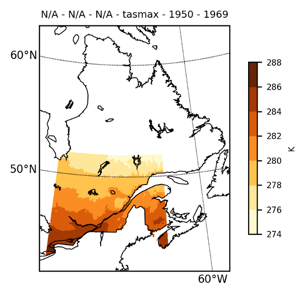
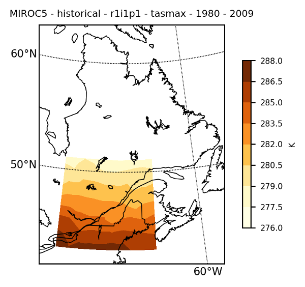
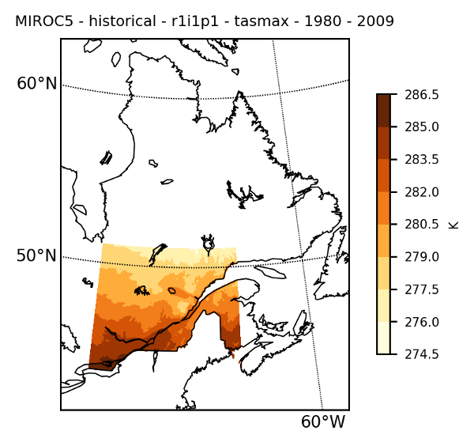

# Examples

# Typical workflow for a climate scenario

*Note. Climate data can be downloaded at [ESGF nodes](https://esgf-node.llnl.gov/projects/esgf-llnl/)*

*Note 2. The following example is somewhat convoluted, but it gives an overview of the main steps allowed by ClimateTools package.*

## Exploration

First step before extracting the data is to explore the actual dataset at hand. The function `Dataset` (reexported from te NCDatasets.jl package) is used to examine the file(s). In this example, the simulation is from the MIROC5 model.

```julia
Dataset("datafile.nc")

Dataset: /path/to/file/tasmax_day_MIROC5_historical_r1i1p1_19900101-19991231.nc
Group: /

Dimensions
   time = 3650
   lat = 128
   lon = 256
   bnds = 2

Variables
  time   (3650)
    Datatype:    Float64
    Dimensions:  time
    Attributes:
     bounds               = time_bnds
     units                = days since 1850-1-1
     calendar             = noleap
     axis                 = T
     long_name            = time
     standard_name        = time

  time_bnds   (2 × 3650)
    Datatype:    Float64
    Dimensions:  bnds × time

  lat   (128)
    Datatype:    Float64
    Dimensions:  lat
    Attributes:
     bounds               = lat_bnds
     units                = degrees_north
     axis                 = Y
     long_name            = latitude
     standard_name        = latitude

  lat_bnds   (2 × 128)
    Datatype:    Float64
    Dimensions:  bnds × lat

  lon   (256)
    Datatype:    Float64
    Dimensions:  lon
    Attributes:
     bounds               = lon_bnds
     units                = degrees_east
     axis                 = X
     long_name            = longitude
     standard_name        = longitude

  lon_bnds   (2 × 256)
    Datatype:    Float64
    Dimensions:  bnds × lon

  height  
    Attributes:
     units                = m
     axis                 = Z
     positive             = up
     long_name            = height
     standard_name        = height

  tasmax   (256 × 128 × 3650)
    Datatype:    Float32
    Dimensions:  lon × lat × time
    Attributes:
     standard_name        = air_temperature
     long_name            = Daily Maximum Near-Surface Air Temperature
     units                = K
     original_name        = T2
     cell_methods         = time: maximum
     cell_measures        = area: areacella
     history              = 2011-10-19T12:39:31Z altered by CMOR: Treated scalar dimension: 'height'. 2011-10-19T12:39:31Z altered by CMOR: replaced missing value flag (-999) with standard missing value (1e+20). 2011-10-19T12:39:31Z altered by CMOR: Inverted axis: lat.
     coordinates          = height
     missing_value        = 1.0e20
     _FillValue           = 1.0e20
     associated_files     = baseURL: http://cmip-pcmdi.llnl.gov/CMIP5/dataLocation gridspecFile: gridspec_atmos_fx_MIROC5_historical_r0i0p0.nc areacella: areacella_fx_MIROC5_historical_r0i0p0.nc

Global attributes
  institution          = AORI (Atmosphere and Ocean Research Institute, The University of Tokyo, Chiba, Japan), NIES (National Institute for Environmental Studies, Ibaraki, Japan), JAMSTEC (Japan Agency for Marine-Earth Science and Technology, Kanagawa, Japan)
  institute_id         = MIROC
  experiment_id        = historical
  source               = MIROC5 2010 atmosphere: MIROC-AGCM6 (T85L40); ocean: COCO (COCO4.5, 256x224 L50); sea ice: COCO (COCO4.5); land: MATSIRO (MATSIRO, L6); aerosols: SPRINTARS (SPRINTARS 5.00, T85L40)
  model_id             = MIROC5
  forcing              = GHG, SA, Oz, LU, Sl, Vl, SS, Ds, BC, MD, OC (GHG includes CO2, N2O, methane, and fluorocarbons; Oz includes OH and H2O2; LU excludes change in lake fraction)
  parent_experiment_id = piControl
  parent_experiment_rip = r1i1p1
  branch_time          = 150015.0
  contact              = Masahiro Watanabe (hiro@aori.u-tokyo.ac.jp), Seita Emori (emori@nies.go.jp), Masayoshi Ishii (ism@jamstec.go.jp), Masahide Kimoto (kimoto@aori.u-tokyo.ac.jp)
  references           = Watanabe et al., 2010: Improved climate simulation by MIROC5: Mean states, variability, and climate sensitivity. J. Climate, 23, 6312-6335
  initialization_method = 1
  physics_version      = 1
  tracking_id          = 54e617f1-31a5-47fd-bd57-8736bb7d00ef
  product              = output
  experiment           = historical
  frequency            = day
  creation_date        = 2011-10-19T12:39:31Z
  history              = 2011-10-19T12:39:31Z CMOR rewrote data to comply with CF standards and CMIP5 requirements.
  Conventions          = CF-1.4
  project_id           = CMIP5
  table_id             = Table day (26 July 2011) f21c16b785432e6bd3f72e80f2cade49
  title                = MIROC5 model output prepared for CMIP5 historical
  parent_experiment    = pre-industrial control
  modeling_realm       = atmos
  realization          = 1
  cmor_version         = 2.7.1

```

You can see the dimensions of the data, as well as the name of the variable(s), in this case "tasmax".

## Extraction

Now, say you need to create a climate scenario, using a given simulation, over a region defined by the following polygon.

```julia
poly_reg = [[NaN -65 -80 -80 -65 -65];[NaN 42 42 52 52 42]]
2×6 Array{Float64,2}:
 NaN  -65.0  -80.0  -80.0  -65.0  -65.0
 NaN   42.0   42.0   52.0   52.0   42.0
```

The extraction of the desired variable can be done with the `nc2julia` function, by providing the polygon.

```julia
gcmfiles =["tasmax_day_MIROC5_historical_r1i1p1_19800101-19891231.nc",
"tasmax_day_MIROC5_historical_r1i1p1_19900101-19991231.nc",
"tasmax_day_MIROC5_historical_r1i1p1_20000101-20091231.nc"]

model = nc2julia(gcm_files, "tasmax", poly=poly_reg)
ClimGrid struct with data:
   3-dimensional AxisArray{Float32,3,...} with axes:
    :time, Date[1980-01-01, 1980-01-02, 1980-01-03, 1980-01-04, 1980-01-05, 1980-01-06, 1980-01-07, 1980-01-08, 1980-01-09, 1980-01-10  …  2009-12-22, 2009-12-23, 2009-12-24, 2009-12-25, 2009-12-26, 2009-12-27, 2009-12-28, 2009-12-29, 2009-12-30, 2009-12-31]
    :lon, [-78.75, -77.3438, -75.9375, -74.5313, -73.125, -71.7188, -70.3125, -68.9063, -67.5, -66.0938]
    :lat, [42.7233, 44.1241, 45.5249, 46.9256, 48.3264, 49.7271, 51.1279]
And data, a 10950×10×7 Array{Float32,3}
Project: CMIP5
Institute: MIROC
Model: MIROC5
Experiment: historical
Run: r1i1p1
Variable: tasmax
Data units: K
Frequency: day
Global attributes: Dict{Any,Any} with 27 entries
Filename: tasmax_day_MIROC5_historical_r1i1p1_19800101-19891231.nc
```

One possible verification of the extracted data is to map the time-mean data with the `mapclimgrid` function to see if there is something wrong.

```julia
mapclimgrid(model, region = "Quebec")
```

Which should return the following map.


### Sidenote: merging files/data

Climate data files are usually on the order of multiple GBs and institution generally split a single simulation into multiple files. In order to calculate climatologies, it is thus essential to merge the data into a single structure. The function `merge` is provided to combine 2 `ClimGrid`.

```julia
C = merge(C1, C2) # merge C1 with C2
```

The `merge` function is useful when you have 2 or 3 files. However, a single simulation can sometimes be splitted into yearly files. Hence, extracting timeseries on climatological timescales can imply loading more than a hundred files just to get a complete timeserie for a given gridpoint. The function `nc2julia` has a method where the 1st positional argument is an Array of strings (as opposed to a single string).

```julia
C = nc2julia(strarray::Array{String,1}, variable::String; poly, start_date::Date, end_date::Date, data_units::String))
```

This is how the MIROC5 simulation has been loaded.


## Bias correction

An important step in climate scenarios design is to correct the statistical bias of the simulations compared against a chosen reference (more often than not, weather observations). A typical method is to do quantile-quantile mapping between the simulation timeseries and observed timeseries. The function `qqmap` does so. First step would be to interpolate the simulated field onto the reference grid. Here we use the dataset provided by the [Canadian Forest Service](https://cfs.nrcan.gc.ca/projects/3/4) (McKenney et al. 2011) for the interpolation step and the bias correction step.

*McKenney, D. W., Hutchinson, M.F., Papadopol, P., Lawrence, K., Pedlar, J., Campbell, K., Milewska, E., Hopkinson, R., Price, D., Owen, T. (2011). "Customized spatial climate models for North America." Bulletin of American Meteorological Society-BAMS December: 1612-1622.*

```julia
obsfiles = ["nrcan_canada_daily_tasmax_1950.nc",
"nrcan_canada_daily_tasmax_1951.nc",
"nrcan_canada_daily_tasmax_1952.nc",
"nrcan_canada_daily_tasmax_1953.nc",
"nrcan_canada_daily_tasmax_1954.nc",
"nrcan_canada_daily_tasmax_1955.nc",
"nrcan_canada_daily_tasmax_1956.nc",
"nrcan_canada_daily_tasmax_1957.nc",
"nrcan_canada_daily_tasmax_1958.nc",
"nrcan_canada_daily_tasmax_1959.nc",
"nrcan_canada_daily_tasmax_1960.nc",
"nrcan_canada_daily_tasmax_1961.nc",
"nrcan_canada_daily_tasmax_1962.nc",
"nrcan_canada_daily_tasmax_1963.nc",
"nrcan_canada_daily_tasmax_1964.nc",
"nrcan_canada_daily_tasmax_1965.nc",
"nrcan_canada_daily_tasmax_1966.nc",
"nrcan_canada_daily_tasmax_1967.nc",
"nrcan_canada_daily_tasmax_1968.nc",
"nrcan_canada_daily_tasmax_1969.nc"]

obs = nc2julia(obsfiles, "tasmax", poly=poly_reg)
```

```julia
mapclimgrid(obs, region = "Quebec")
```



### Interpolation

The interpolation is done with the `interp_climgrid` function. The following command interpolate the values of `ClimGrid model` onto the grid of `ClimGrid obs`.

```julia
modelinterp = interp_climgrid(model, obs)
Progress: 100%|█████████████████████████████████████████| Time: 0:00:38
ClimGrid struct with data:
   3-dimensional AxisArray{Float64,3,...} with axes:
    :time, Date[1980-01-01, 1980-01-02, 1980-01-03, 1980-01-04, 1980-01-05, 1980-01-06, 1980-01-07, 1980-01-08, 1980-01-09, 1980-01-10  …  2009-12-22, 2009-12-23, 2009-12-24, 2009-12-25, 2009-12-26, 2009-12-27, 2009-12-28, 2009-12-29, 2009-12-30, 2009-12-31]
    :lon, Float32[-79.9583, -79.875, -79.7917, -79.7083, -79.625, -79.5417, -79.4583, -79.375, -79.2917, -79.2083  …  -65.7917, -65.7083, -65.625, -65.5417, -65.4583, -65.375, -65.2917, -65.2083, -65.125, -65.0417]
    :lat, Float32[51.9583, 51.875, 51.7917, 51.7083, 51.625, 51.5417, 51.4583, 51.375, 51.2917, 51.2083  …  42.7917, 42.7083, 42.625, 42.5417, 42.4583, 42.375, 42.2917, 42.2083, 42.125, 42.0417]
And data, a 10950×180×120 Array{Float64,3}
Project: CMIP5
Institute: MIROC
Model: MIROC5
Experiment: historical
Run: r1i1p1
Variable: tasmax
Data units: K
Frequency: day
Global attributes: Dict{Any,Any} with 27 entries
Filename: tasmax_day_MIROC5_historical_r1i1p1_19800101-19891231.nc
```

```julia
julia> mapclimgrid(modelinterp, region = "Quebec")
```



Notice that there is no new information created here. The interpolation is using Scipy's griddata under the hood and is simply a linear interpolation onto the *obs* grid.

### Quantile-quantile mapping

The high-resolution local information is integrated into `ClimGrid modelinterp` at the bias correction step. There is a daily transfer function applied on a quantile basis.The call signature is `qqmap(obs, ref, fut)` where the transfer function is estimated between `obs` and `ref` and applied on `fut`. Note that `ref` and `fut` can be the same, as in this example. A typical use-case would be `obs` and `ref` covering the same (historical, e.g. 1961-2010) temporal window and `fut` being a simulation covering a future climatological period (which could be a mix of historic and future, such as 1961-2090). This step is computationally intensive.

```julia
model_qqmap = qqmap(obs, modelinterp, modelinterp)
Progress: 100%|█████████████████████████████████████████| Time: 0:11:20
ClimGrid struct with data:
   3-dimensional AxisArray{Float64,3,...} with axes:
    :time, Date[1980-01-01, 1980-01-02, 1980-01-03, 1980-01-04, 1980-01-05, 1980-01-06, 1980-01-07, 1980-01-08, 1980-01-09, 1980-01-10  …  2009-12-22, 2009-12-23, 2009-12-24, 2009-12-25, 2009-12-26, 2009-12-27, 2009-12-28, 2009-12-29, 2009-12-30, 2009-12-31]
    :lon, Float32[-79.9583, -79.875, -79.7917, -79.7083, -79.625, -79.5417, -79.4583, -79.375, -79.2917, -79.2083  …  -65.7917, -65.7083, -65.625, -65.5417, -65.4583, -65.375, -65.2917, -65.2083, -65.125, -65.0417]
    :lat, Float32[51.9583, 51.875, 51.7917, 51.7083, 51.625, 51.5417, 51.4583, 51.375, 51.2917, 51.2083  …  42.7917, 42.7083, 42.625, 42.5417, 42.4583, 42.375, 42.2917, 42.2083, 42.125, 42.0417]
And data, a 10950×180×120 Array{Float64,3}
Project: CMIP5
Institute: MIROC
Model: MIROC5
Experiment: historical
Run: r1i1p1
Variable: tasmax
Data units: K
Frequency: NA
Global attributes: Dict{Any,Any} with 0 entries
Filename: tasmax_day_MIROC5_historical_r1i1p1_19800101-19891231.nc
```

Mapping the results show that the local information is integrated into the model, and that the natural "mask" of the observation grid is applied naturally.

```julia
mapclimgrid(model_qqmap, region = "Quebec")
```



Proper assessment of future climate conditions over the specified region would involve replicating these steps for minimally a dozen simulations from multiple models and different emission scenarios (e.g. RCP4.5, RCP8.5, etc.).
